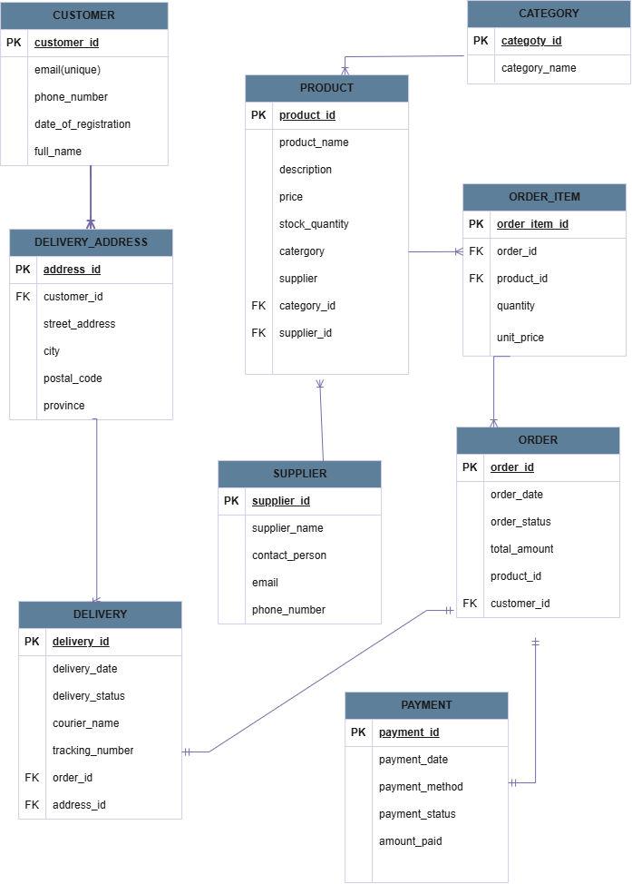

# WitleShop Online Retail System

Entity Relationship Diagram (ERD) for **WitleShop (Pty) Ltd**, a South African online retailer selling electronics, clothing, and home appliances through a web and mobile platform.

## Background

WitleShop is growing fast and needs a database to manage customers, products, orders, payments, deliveries, and suppliers. This repository contains the database design in the form of an ERD.

## ERD

## Entities, Attributes and Keys

PK = Primary Key, FK = Foreign Key

| Entity | Attributes | Keys |
|--------|-----------|------|
| **Customer** | customer_id, full_name, email (unique), phone_number, registration_date | PK: customer_id |
| **Address** | address_id, customer_id, street, suburb, city, province, postal_code | PK: address_id; FK: customer_id |
| **Category** | category_id, category_name | PK: category_id |
| **Supplier** | supplier_id, supplier_name, contact details | PK: supplier_id |
| **Product** | product_id, product_name, description, price, stock_quantity, category_id, supplier_id | PK: product_id; FK: category_id, supplier_id |
| **Order** | order_id, customer_id, order_date, order_status, total_amount | PK: order_id; FK: customer_id |
| **Order_Item** | order_id, product_id, quantity, unit_price | PK: (order_id, product_id); FK: order_id, product_id |
| **Payment** | payment_id, order_id, payment_date, payment_method, payment_status, amount_paid | PK: payment_id; FK: order_id (unique) |
| **Delivery** | delivery_id, order_id, address_id, delivery_date, delivery_status, courier_name, tracking_number | PK: delivery_id; FK: order_id (unique), address_id |

**Allowed values**

- Order status: Pending, Shipped, Delivered, Cancelled
- Payment method: Card, EFT, PayFast

## Relationships and Cardinality

| Relationship | Cardinality | Explanation |
|--------------|-------------|-------------|
| Customer – Address | 1:M | A customer can have many delivery addresses; each address belongs to one customer |
| Customer – Order | 1:M | A customer can place many orders; each order belongs to one customer |
| Category – Product | 1:M | A category has many products; each product belongs to one category |
| Supplier – Product | 1:M | A supplier supplies many products; each product has one supplier |
| Order – Product | M:N | An order can contain many products and a product can appear in many orders |
| Order – Payment | 1:1 | Each order has one payment; each payment belongs to one order |
| Order – Delivery | 1:1 | Each order has one delivery; each delivery belongs to one order |
| Address – Delivery | 1:M | An address can be used for many deliveries; each delivery goes to one address |

### Resolving the Many-to-Many Relationship

The M:N relationship between **Order** and **Product** is resolved with the junction table **Order_Item**. It holds the composite primary key (order_id, product_id) and stores the quantity and unit price of each product in an order. This gives two 1:M relationships:

- Order (1) → (M) Order_Item
- Product (1) → (M) Order_Item

## Business Rules

- Customers must register before placing an order.
- Email addresses must be unique.
- Every order must have exactly one payment and one delivery record.
- A delivery must be linked to one of the ordering customer's registered addresses.

## Repository Contents

| File | Description |
|------|-------------|
| `README.md` | Project documentation |
| `witleshop-erd.drawio.png` | ERD image (can be opened and edited in draw.io) |

## Tools Used

- [draw.io](https://www.drawio.com/) for the ERD
- GitHub for version control

## Author

Created by [Pertunia931](https://github.com/Pertunia931)
